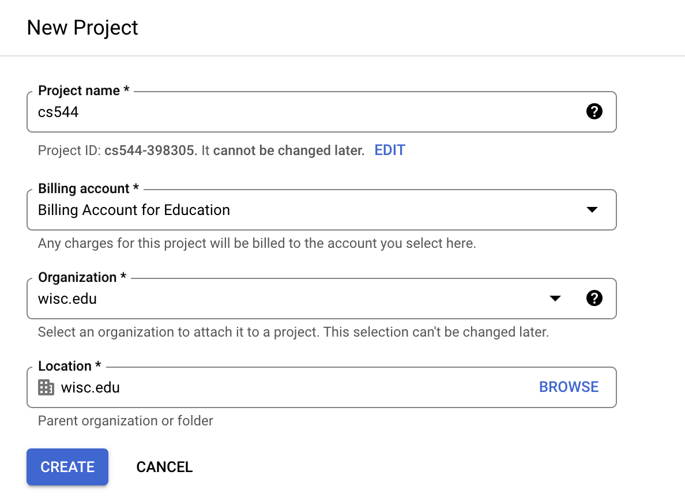
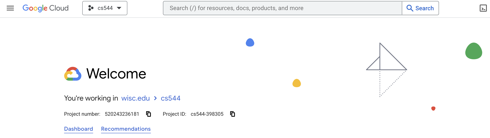

# Setup
## Project

Any **resources** we create (like virtual machines), are grouped into
**projects**.  Each project is associated with a billing account.

1. go to the "Manage Resources" page in the console.  It is under the drop-down menu in the top-left: "IAM & Admin" > "Manage Resources".  Or, here is a link for quick access: https://console.cloud.google.com/cloud-resource-manager

2. click "CREATE PROJECT"

3. call it something like "cs544" and associate it with your account that has the free credits.  Sometimes an option will appear to select an organization in which to nest your project.  If this happens, select "wisc.edu".

4. after it is created, click "SELECT PROJECT"

5. in general, when working in the console, make sure your project is selected when given the option

## Create a VM instance

1. Under the selected project, click the catalog icon on the top-left corner and find Compute Engine. Then select VM instances.

2. Click Create an instance. Manage Machine configuration as E2 and machine type as e2-small.
  

3. Click change under the boot disk to use 25 GB boot drive and Ubuntu 22.04 LTS -- select the x86/64 version (not Arm64)
 

4. Check the cost to ensure you get everything right and click CREATE. The monthly estimate should be about $14.73 for the VM (if its not, you probably selected something wrong, and might run out of free credits before the end of the semester).

