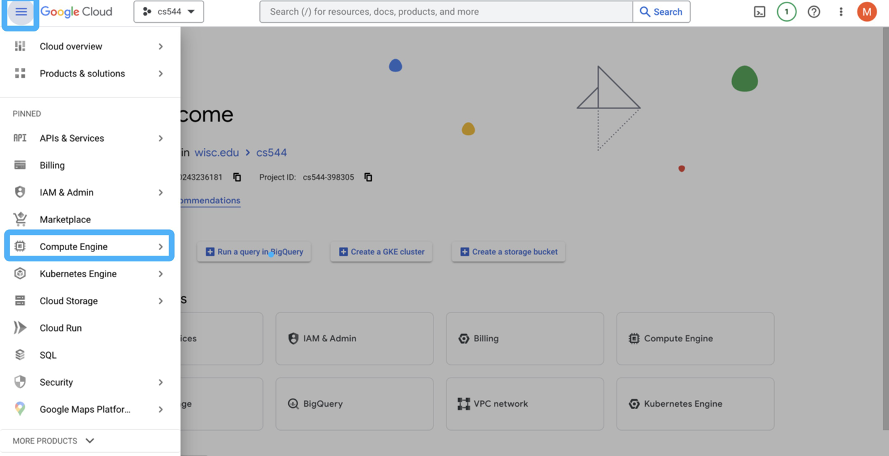
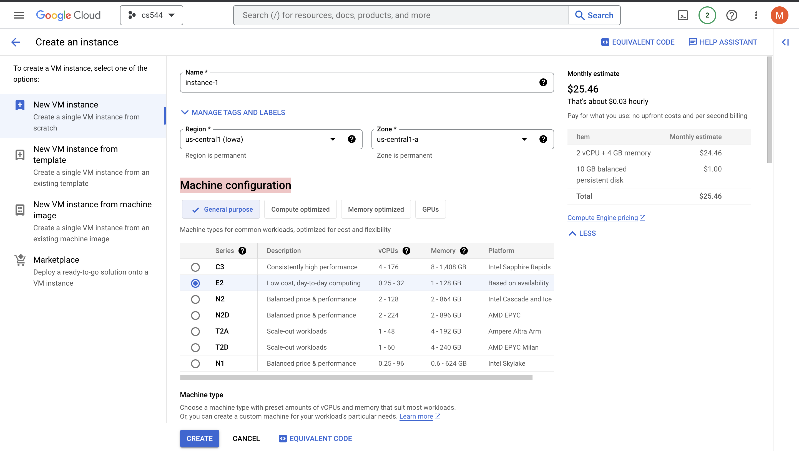
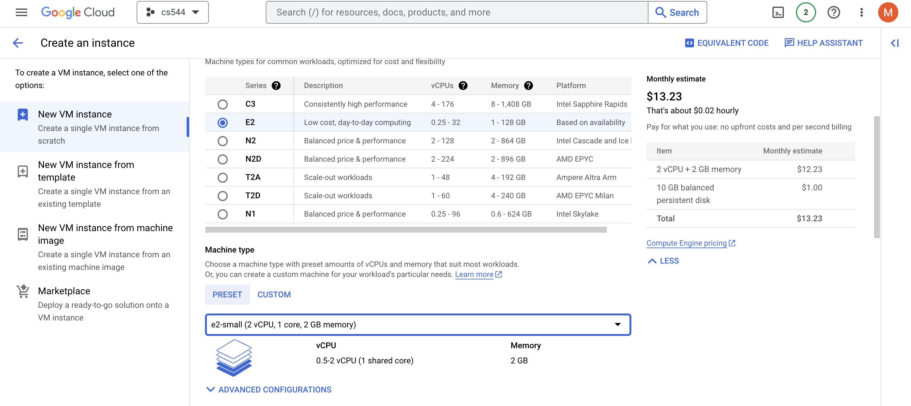
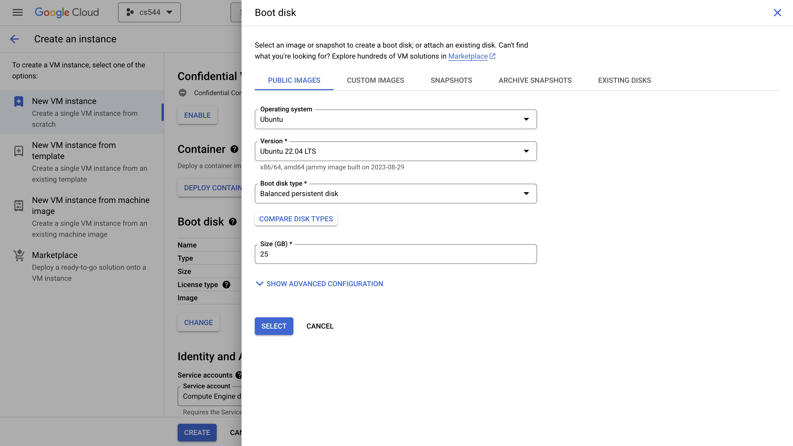
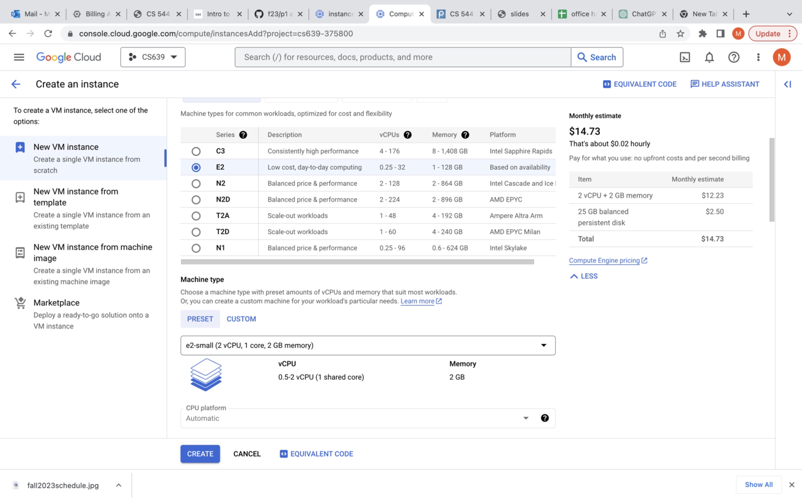

# Create a VM instance

1. Under the selected project, click the catalog icon on the top-left corner and find Compute Engine. Then select VM instances.

2. Click Create an instance. Manage Machine configuration as E2 and machine type as e2-small. 

3. Click change under the boot disk to use 25 GB boot drive and Ubuntu 22.04 LTS -- select the x86/64 version (not Arm64)
 

4. Check the cost to ensure you get everything right and click CREATE

