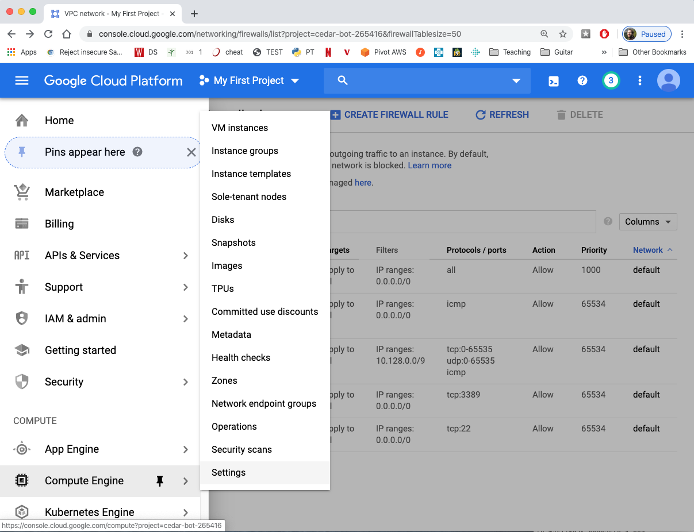
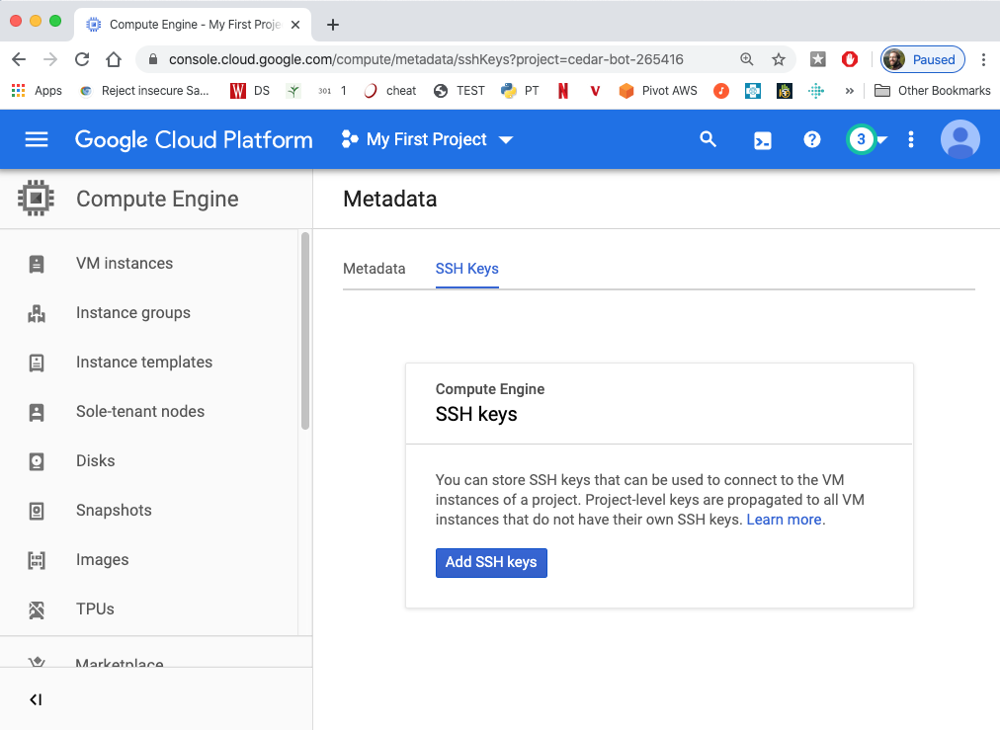
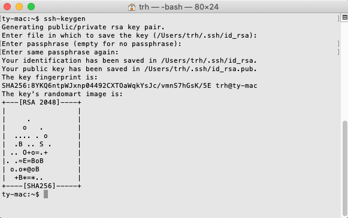
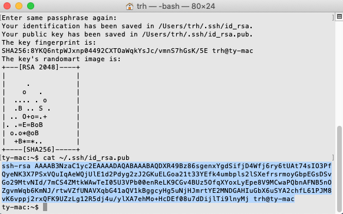
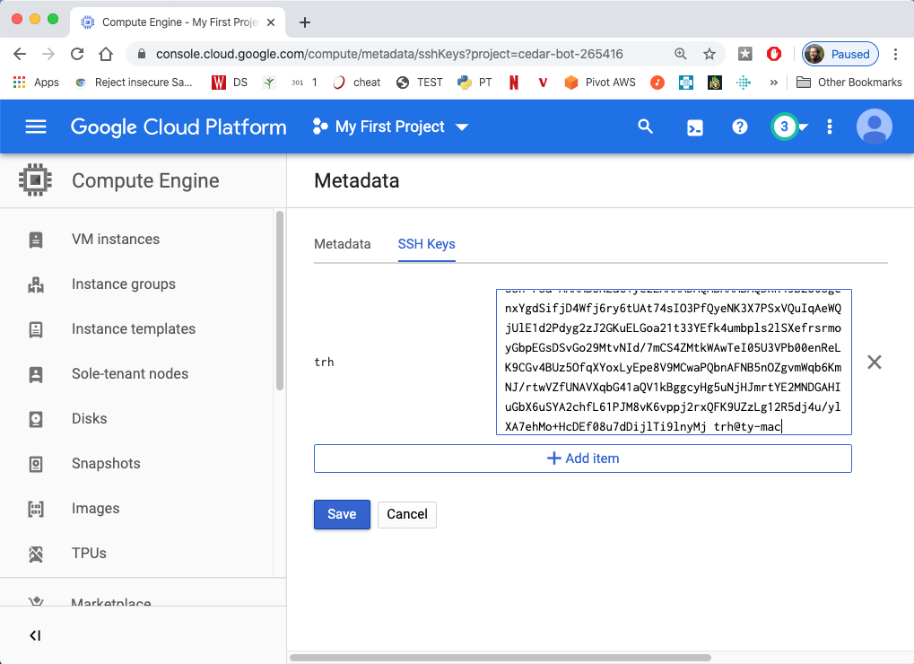
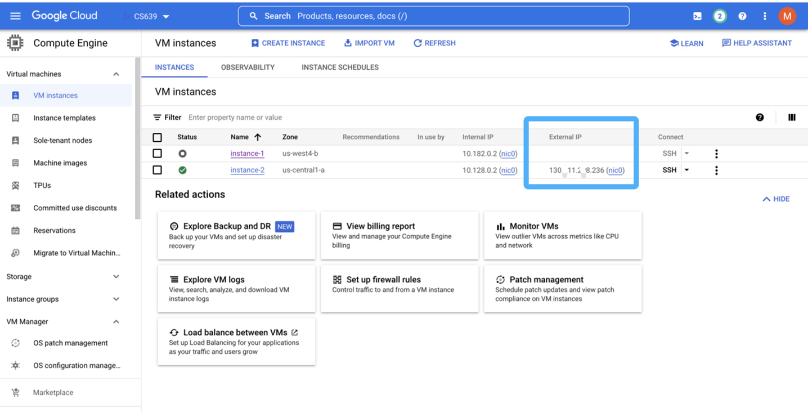

# Setup
## Project

Any **resources** we create (like virtual machines), are grouped into
**projects**.  Each project is associated with a billing account.

1. go to the "Manage Resources" page in the console.  It is under the drop-down menu in the top-left: "IAM & Admin" > "Manage Resources".  Or, here is a link for quick access: https://console.cloud.google.com/cloud-resource-manager

2. click "CREATE PROJECT"

3. call it something like "cs544" and associate it with your account that has the free credits.  Sometimes an option will appear to select an organization in which to nest your project.  If this happens, select "wisc.edu".

4. after it is created, click "SELECT PROJECT"

5. in general, when working in the console, make sure your project is selected when given the option

## Create a VM instance

1. Under the selected project, click the catalog icon on the top-left corner and find "Compute Engine". Then select VM instances.

2. Click "Create an instance". Manage Machine configuration as E2 and machine type as e2-small.
  

3. Click "change" under the boot disk to use 25 GB boot drive and Ubuntu 22.04 LTS -- select the x86/64 version (not Arm64)
 

4. Check the cost to ensure you get everything right and click CREATE. The monthly estimate should be about $14.73 for the VM (if its not, you probably selected something wrong, and might run out of free credits before the end of the semester).

## SSH

1. In the cloud console, find "Compute Engine" under "COMPUTE", and click "Metadata" (it's roughly in the middle of the "Compute Engine" menu).

2. Go to "SSH Keys" and click "Add SSH keys".  There will be a box where we need to paste a key, which we haven't generated yet.

3. Open your terminal(MacOS) or PowerShell(Windows), and run the command `ssh-keygen`.  You should be able to just use the defaults by
hitting enter a few times (I don't recommend setting a password for this or a passphrase). It looks like the following on a Mac, but
should work the same on Windows.  If `ssh-keygen` isn't found, then you should skip the rest of this section and go back to the next steps
on the [main page](README.md) for now (feel free to get help more specific to your setup during office hours).

Note that the `ssh-keygen` creates a "private key" on the computer where you run it that will let you connect to your VM without a
password via SSH this semester.  If you switch computers at some point, you'll need to revisit this part of the lab.

4. run `cat ~/.ssh/id_rsa.pub`.  Then copy the output (the part highlighted in the following screenshot).(If your using windows, run the command using windows powershell)

5. go back to where you were adding an SSH key in the Google cloud console and paste your key (as copied in step 4).  Make a note of the
username that appears to the left of the box (in this case "trh") -- you'll need it later.

6. Then click "Save".
7. Get the external IP of your virtual machine under the Computer Engine page.
8. You can access your virtual machine by entering "ssh username@External IP" like "ssh tyler@34.125.78.792" in your terminal or your PowerShell.

